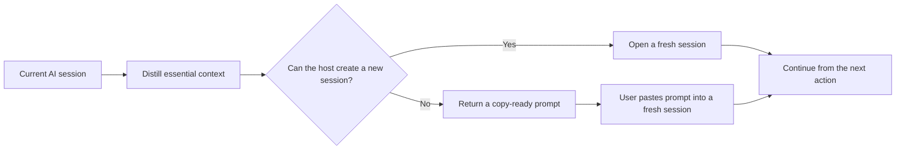

<div align="center">
  
</div>

<div align="center">

[](./LICENSE)


**A clean continuation path for long AI sessions.**

Preserve what matters. Drop the transcript. Let the agent keep going.

</div>

---

## What it does

`take-it-from-here` lets the user hand the remaining work to the agent. It compresses the execution-critical state of a long session into a continuation note of at most 800 tokens, opens a fresh session when possible, and continues working there.

It keeps:

- the objective and current phase;
- completed work and verification;
- exact important file paths;
- decisions, constraints, blockers, and rejected approaches;
- one concrete next action.

It leaves behind:

- the full conversation;
- large logs and file dumps;
- secrets and credentials;
- speculative or irrelevant history.

## How it adapts



The core workflow is stored in `SKILL.md` and is not tied to a specific model.

| Host capability | Result |
|---|---|
| Can create tasks or sessions | Opens a fresh session and continues the work |
| Cannot create sessions | Returns one copy-ready continuation block |
| Supports title tools | Gives the new session a short useful title |
| Uses another invocation syntax | Natural-language triggering still works |

`agents/openai.yaml` provides optional OpenAI interface metadata. Other compatible agents can ignore it.

## Install

### With the Codex skill installer

```bash
python ~/.codex/skills/.system/skill-installer/scripts/install-skill-from-github.py \
  --repo MarkusBonazzi/take-it-from-here \
  --path take-it-from-here
```

### Manually

Copy the `take-it-from-here` directory into the skills directory used by your AI host:

```text
<skills-directory>/take-it-from-here/
├── SKILL.md
└── agents/
    └── openai.yaml
```

Restart the host or begin a new session after installation.

## Use

Invoke it directly:

```text
$take-it-from-here
```

Or delegate naturally:

```text
Take it from here.
Handle the rest.
Move this to a fresh session and keep going.
Continue this in a new task.
Возьми дальше на себя.
Продолжи в новой задаче.
Перенеси работу в свежую сессию и продолжай.
Доделай сам.
```

The continuation note follows the user's current language. Commands, code, paths, filenames, identifiers, and error messages stay unchanged.

## Privacy by design

The skill explicitly forbids including:

- secrets, credentials, or private keys;
- complete transcripts or large logs;
- full file contents;
- unsupported guesses about earlier work.

The original session is left unchanged and unarchived. Work continues only in the fresh session, avoiding duplicate execution in both places.

## Repository layout

```text
.
├── README.md
├── LICENSE
├── assets/
│   └── hero.svg
└── take-it-from-here/
    ├── SKILL.md
    └── agents/
        └── openai.yaml
```

## License

Released under the [MIT License](./LICENSE).
