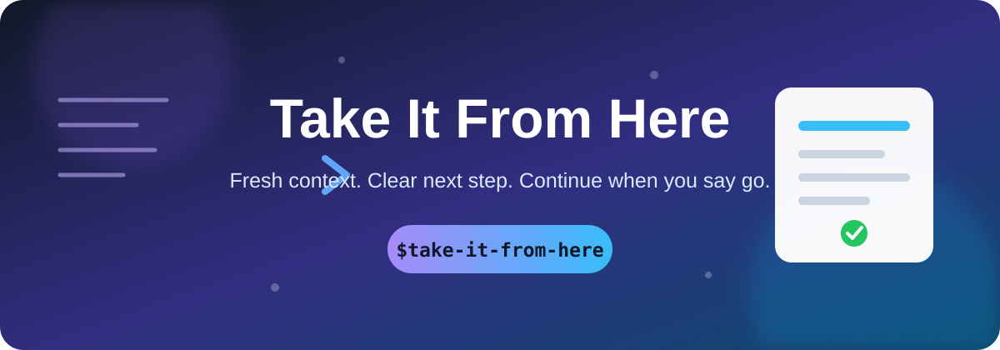
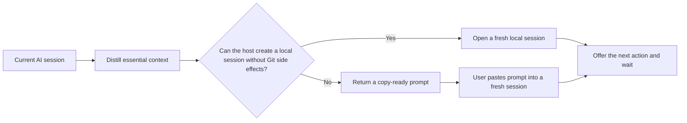

<div align="center">
  
</div>

<div align="center">

[](./LICENSE)


**A clean pause-and-continue path for long AI sessions.**

Preserve what matters. Drop the transcript. Continue only when you say go.

</div>

---

## What it does

`take-it-from-here` prepares the remaining work for a fresh AI session. It compresses the execution-critical state into a continuation note of at most 800 tokens, opens a fresh local session when that can be done without creating a Git branch or worktree, and offers one concrete next action without starting it.

It keeps:

- the objective and current phase;
- completed work and verification;
- exact important file paths;
- decisions, constraints, blockers, and rejected approaches;
- one concrete next action.

It leaves behind:

- the full conversation;
- large logs and file dumps;
- secrets and credentials;
- speculative or irrelevant history.

## How it adapts



The core workflow is stored in `SKILL.md` and is not tied to a specific model.

| Host capability | Result |
|---|---|
| Can create a local task without a branch, worktree, or history fork | Opens a fresh local session, offers to continue, and waits |
| Only branch/worktree creation is available | Returns one copy-ready continuation block |
| Cannot create sessions | Returns one copy-ready continuation block |
| Supports title tools | Gives the new session a short useful title |
| Uses another invocation syntax | Natural-language triggering still works |

`agents/openai.yaml` provides optional OpenAI interface metadata. Other compatible agents can ignore it.

## Install

### With the Codex skill installer

```bash
python ~/.codex/skills/.system/skill-installer/scripts/install-skill-from-github.py \
  --repo MarkusBonazzi/take-it-from-here \
  --path take-it-from-here
```

### Manually

Copy the `take-it-from-here` directory into the skills directory used by your AI host:

```text
<skills-directory>/take-it-from-here/
├── SKILL.md
└── agents/
    └── openai.yaml
```

Restart the host or begin a new session after installation.

## Use

Invoke it directly:

```text
$take-it-from-here
```

Or ask it to prepare the continuation:

```text
Prepare this for a fresh session.
Move the context to a new task and wait.
Set up the next session, but do not start yet.
Offer to continue from the next step.
Подготовь продолжение в новой задаче.
Перенеси контекст и жди моей команды.
Создай свежую сессию, но пока не начинай работу.
Предложи продолжить со следующего шага.
```

The continuation note follows the user's current language. Commands, code, paths, filenames, identifiers, and error messages stay unchanged.

## Privacy by design

The skill explicitly forbids including:

- secrets, credentials, or private keys;
- complete transcripts or large logs;
- full file contents;
- unsupported guesses about earlier work.

The original session is left unchanged and unarchived. The skill does not create or switch Git branches, create worktrees, or fork conversation history. No work resumes until the user explicitly confirms it in the fresh session.

## Repository layout

```text
.
├── README.md
├── LICENSE
├── assets/
│   └── hero.svg
└── take-it-from-here/
    ├── SKILL.md
    └── agents/
        └── openai.yaml
```

## License

Released under the [MIT License](./LICENSE).
